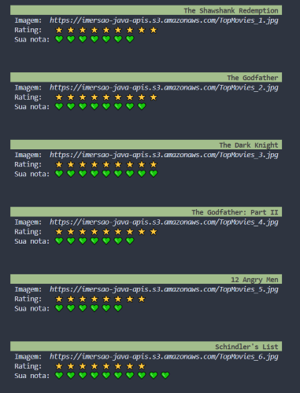
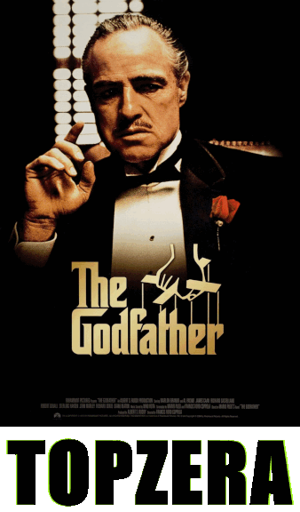
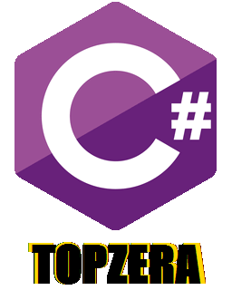

# Imersão (Backend) Alura

Projetos desenvolvido em C# e .NET 6 a partir da _Imersão Java Alura_, neste evento foram desenvolvidos 2 projetos:

- Projeto em console **Stickers** que pega uma imagem, adiciona um texto e salva como uma nova imagem para ser usada como sticker nas redes sociais.
- Projeto web API **Languages** e conexão com o banco de dados MongoDB para cadastro das linguagens de programação e endereço da logo da linguagem

## Descrição

### 1º Dia

- Fazer chamada da API, método GET.
  - Usar API mockada do top 250 filmes do IMDB.
- Armazenar a resposta em uma variável do tipo string
- Criar uma classe com um método que usa expressões regulares para transformar e organizar as informações da resposta em um dicionário, com o nome e o valor do atributo.
- Exibir somente as informações selecionadas: título, link da imagem e nota dos filmes.

#### 🚀 Desafios do 1º dia

- [ ] Consumir o endpoint de filmes mais populares da API do IMDB. Procure também, na documentação da API do IMDB, o endpoint que retorna as melhores séries e o que retorna as séries mais populares.
- [ ] ~~Colocar a chave da API do IMDB em algum lugar fora do código como um arquivo de configuração (p. ex, um arquivo .properties) ou uma variável de ambiente.~~
  > _Usei a API mockada, por isso não houve necessidade de usar a chave de segurança._
- [x] Usar sua criatividade para deixar a saída dos dados mais bonitinha: usar emojis com código UTF-8, mostrar a nota do filme como estrelinhas, decorar o terminal com cores, negrito e itálico usando códigos ANSI, e mais!
- [x] Mudar o JsonParser para usar uma biblioteca de parsing de JSON
  > _Usei a Classe `JsonSerializer` do Namespace `System.Text.Json`._
- [x] **Desafio supremo:** criar alguma maneira para você dar uma avaliação ao filme, puxando de algum arquivo de configuração ou pedindo a avaliação para o usuário digitar no terminal.

> _Para resolver os desafios criei as classes `MoviesList` e `Movie` para auxiliar na manipulação dos dados da API._  

  

### 2º Dia

- Criar classe com método para ler, editar e salvar imagem.
  - Testar usando imagem salva no computador.
  - Testar usando endereço de imagem da internet.
- Adicionar parâmetros ao método: para o endereço da imagem e para o nome final da figurinha pronta.

> _Para fazer a figurinha usei o namespace `System.Drawing` que é específica para Windows. Sendo necessário instalar o pacote `System.Drawing.Common`._

#### 🚀 Desafios do 2º dia

- [x] Centralizar o texto na figurinha.
- [x] Colocar outra fonte como a `Comic Sans` ou a `Impact`, a fonte usada em memes.
- [x] Colocar contorno (outline) no texto da imagem.
  > _Fiz esse desafio fazendo a sobreposição de textos, modificando a posição e a cor._
- [x] Criar diretório de saída das imagens, se ainda não existir.
- [x] Tratar as imagens retornadas pela API do IMDB para pegar uma imagem maior ao invés dos thumbnails. Opções: pegar a URL da imagem e remover o trecho mostrado durante a aula ou consumir o endpoint de posters da API do IMDB (mais trabalhoso), tratando o JSON retornado.
- [x] Fazer com que o texto da figurinha seja personalizado de acordo com as classificações do IMDB.
  > _Para esse desafio, adicionei mais um parâmetro no método de criar o sticker: ```string texto```, que vai ser adicionada a imagem._
- [ ] **Desafio supremo:** usar alguma biblioteca de manipulação de imagens como OpenCV pra extrair imagem principal e contorná-la.  

  

### 3º Dia

- Usar API da NASA.
  - [APIs Públicas](https://github.com/public-apis/public-apis).
- Refatorar código seguindo o Paradigma da Orientação à Objetos.

#### 🚀 Desafios do 3º dia

- [x] Transformar a classe que representa os conteúdos em um Record.
- [x] Criar as suas próprias exceções e usá-las na classe que implementa o cliente HTTP.
- [x] ~~Usar recursos do Java 8 e posterior, como Streams.~~
  > _Em C# usei LINQ e Lambdas para mapear uma lista em uma outra._
- [x] ~~Criar uma Enum que une, como configurações, a URL da API e o extrator utilizado.~~
  > _Em C# não é possível usar enum como é usado em Java. Por isso, fiz uma classe com os campos `private readonly`, criei os objetos como `static readonly`, para deixar o mais parecido possível com um enum em Java._
- [x] **Desafio supremo:** consumir outras APIs que contém imagens, como a da Marvel, que é bem diferente.

  > _A API utilizada foi a _Pexels_ que precisa adicionar uma chave de acesso - [Photos provided by Pexels](https://www.pexels.com)._    
  > _Utilizei o endpoint de curadoria, que são fotos selecionadas pela equipe da Pexels e são atualizadas de hora em hora._    
  > _A chave foi salva separadamente em um arquivo Secrets (gerenciador de secredos), para isso, instalei o pacote `Microsoft.Extensions.Configuration.UserSecrets`_  

#### Além dos desafios:
- Separei parte do método `CreateSticker`, que estava muito longo, em outros métodos:  
  - `GetImage` que pega a imagem da internet.  
  - `CalculateWordSpace` para calcular o espaço para adicionar o texto, dependendo da altura e comprimento da imagem.
  - `AddTextToSticker` para toda a parte do código de criar e adicionar o texto.
  - `SaveSticker` para a parte do código que salva o sticker.  
- Alterei a forma que a deserialização das API (`Parse`) estava sendo feita, deixei de usar o arquivo criado durante a imersão que usa expressões regulares, e passei a usar as funcionalidades disponíveis no namespace `System.Text.Json`.

  

### 4º Dia

- Construir API REST que armazena as logos das linguagens de programação, que pode ser usada na aplicação de criar stickers.
  - Imagens usadas do repositório [*Programming Languages Logos*](https://github.com/abranhe/programming-languages-logos).  
- Conectar a API ao banco de dados NoSQL MongoDB.

#### 🚀 Desafios do 4º dia

- [x] Finalizar o CRUD (Create, Read, Update e Delete) para que se possa atualizar e excluir uma linguagem cadastrada;
- [x] Devolver a listagem ordenada pelo ranking;
- [x] Criar na sua API um modelo de entidade com nomes diferentes de title e image ou, manter com o nome title e image e traduzir para que seja retornado como título e imagem através do uso de DTO (Data Transfer Object);
- [x] Retornar o status 201 quando um recurso (linguagem, no nosso caso) for cadastrado através do POST;
- [x] Criar seu próprio extrator de figurinhas personalizado;
- [x] **Desafio supremo**: Aplicar modificações parciais no recurso através do método PATCH, por exemplo, modificando o número de votos ou de pessoas que utilizam cada linguagem de programação.
  > _Inicialmente o rank das linguagens foi atribuído seguindo o [Top das linguagens usadas em 2022 do GitHub](https://octoverse.github.com/2022/top-programming-languages)._  
  > _O método PATCH adiciona mais um voto na contagem da linguagem escolhida e atualiza o rank das linguagens a partir da contagem de votos._

  

### 5º Dia
- Criar uma imagem Docker da API das linguagens
- Fazer o deploy da API usando o Fly.io

#### 🚀 Desafios do 5º dia
- Sem desafios para essa aula. 
- Fiz a imagem da API das linguagens, que tendo o Docker instalado, pode ser baixada e executada pelo comando:
  
  ```
  docker run -p 8080:80 mpoleto/programming-languages-api:1.0
  ```
  - Ao executar o container é possível:
    - Acessar a lista de linguagens já adicionadas, por meio do endereço ```http://localhost:8080/languages```
    - Acessar todas os endpoints por meio do Swagger UI ```http://localhost:8080/swagger/index.html```

## Referências

Além das aulas da imersão, os conteúdos que me ajudaram a construir os projetos:
- [Documentação *Namespace System.Drawing*](https://learn.microsoft.com/pt-br/dotnet/api/system.drawing?view=net-6.0)
- [Documentação *Classe HttpClient*](https://learn.microsoft.com/pt-br/dotnet/api/system.net.http.httpclient?view=net-6.0)
- [Efficient api calls with HttpClient and JSON.NET](https://johnthiriet.com/efficient-api-calls/)
- [Using Windows.Web.Http's HttpClient for Image Download: A Guide](https://copyprogramming.com/howto/how-do-i-use-the-new-httpclient-from-windows-web-http-to-download-an-image)
- [How to download an online file and store it on file system with C#](https://www.code4it.dev/blog/download-and-save-files/)
- [C# vs Java Enum (for those new to C#)](https://stackoverflow.com/questions/469287/c-sharp-vs-java-enum-for-those-new-to-c/4778347#4778347)
- [Java like Enums in C#](https://bawaji94.medium.com/java-like-enums-in-c-4c961f98072c)
- [Documentação *How to use a JSON document object model in System.Text.Json*](https://learn.microsoft.com/en-us/dotnet/standard/serialization/system-text-json/use-dom)
- [Create a web API with ASP.NET Core and MongoDB](https://learn.microsoft.com/en-us/aspnet/core/tutorials/first-mongo-app?view=aspnetcore-6.0&tabs=visual-studio-code)
- [Joining Collections in MongoDB with .NET Core and an Aggregation Pipeline](https://www.mongodb.com/developer/languages/csharp/joining-collections-mongodb-dotnet-core-aggregation-pipeline/)
- [Curso de Docker: criando e gerenciando containers](https://cursos.alura.com.br/course/docker-criando-gerenciando-containers)
- [Tutorial: Colocar um aplicativo .NET em contêiner](https://learn.microsoft.com/pt-br/dotnet/core/docker/build-container?tabs=windows&pivots=dotnet-7-0)